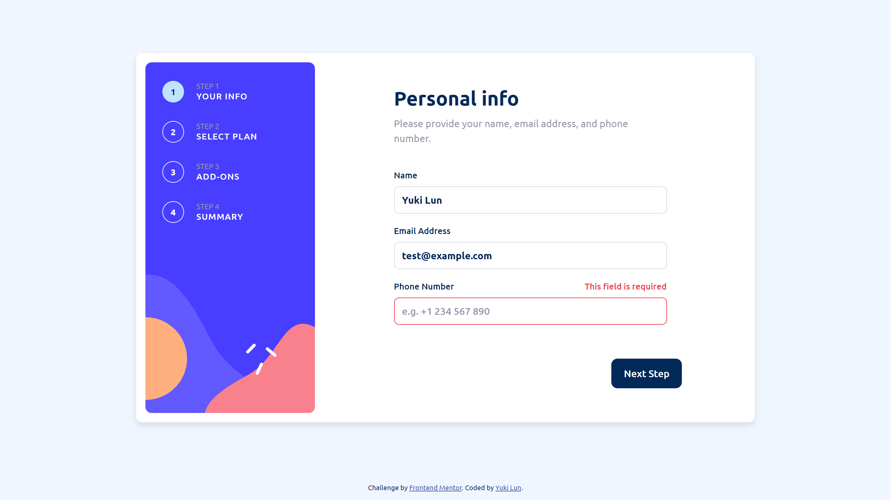
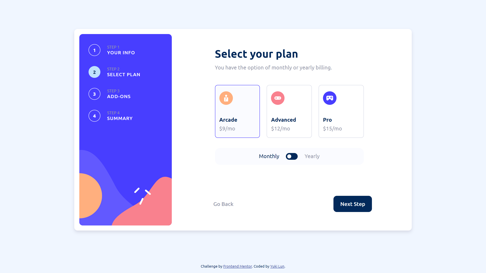
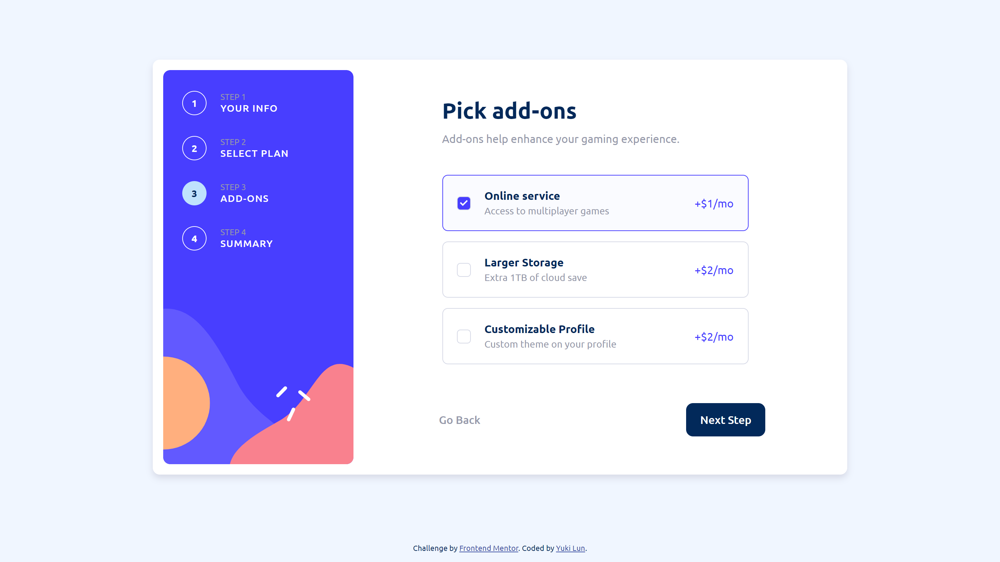
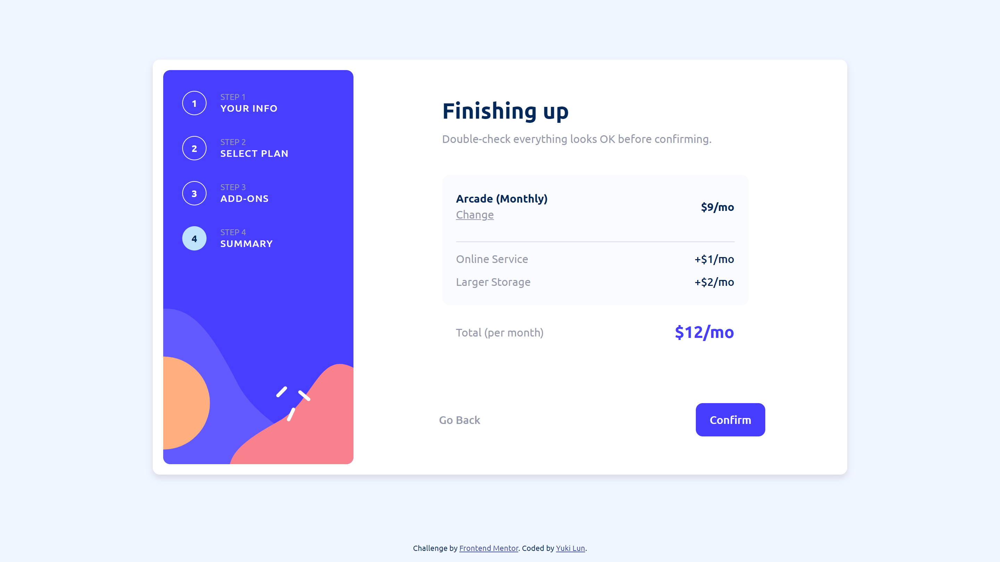
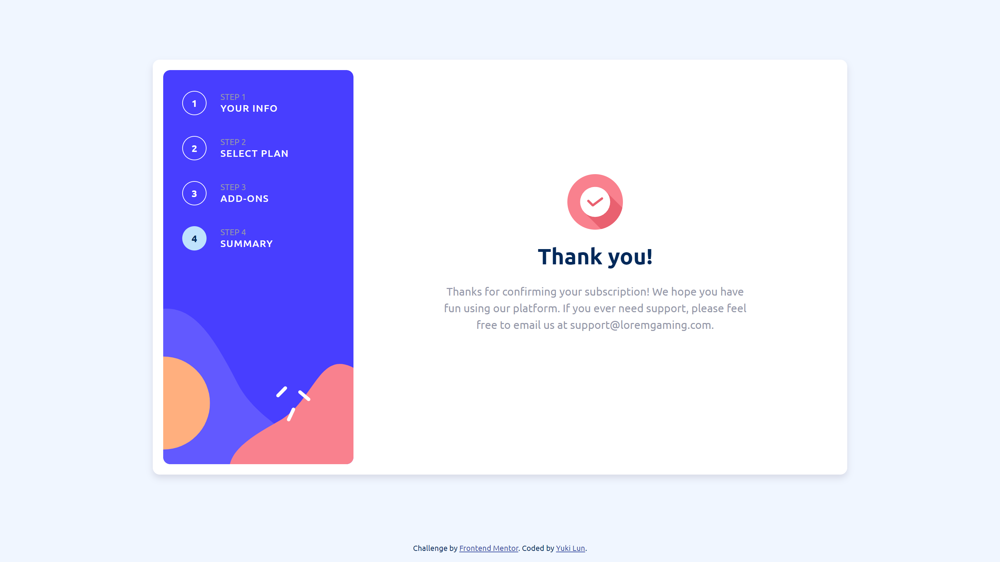

# Frontend Mentor - Multi-step form solution

This is a solution to the [Multi-step form challenge on Frontend Mentor](https://www.frontendmentor.io/challenges/multistep-form-YVAnSdqQBJ). Frontend Mentor challenges help you improve your coding skills by building realistic projects. 

## Table of contents

- [Overview](#overview)
  - [The challenge](#the-challenge)
  - [Screenshots](#screenshots)
  - [Links](#links)
- [My process](#my-process)
  - [Built with](#built-with)
  - [What I learned](#what-i-learned)
- [Author](#author)

## Overview

### The challenge

Users should be able to:

- Complete each step of the sequence
- Go back to a previous step to update their selections
- See a summary of their selections on the final step and confirm their order
- View the optimal layout for the interface depending on their device's screen size
- See hover and focus states for all interactive elements on the page
- Receive form validation messages if:
  - A field has been missed
  - The email address is not formatted correctly
  - A step is submitted, but no selection has been made

### Screenshots

### Links

- Solution URL: [https://github.com/yukilun/multi-step-form](https://github.com/yukilun/multi-step-form)
- Live Site URL: [https://yukilun.github.io/multi-step-form/](https://yukilun.github.io/multi-step-form/)

## My process

### Built with
- CSS variables
- Flexbox
- Mobile-first workflow
- [Vue.js](https://vuejs.org/) - JS library
- [Pinia](https://pinia.vuejs.org/) - State management library for Vue.js 

### What I learned

- Transformed existing responsive web design into code
- Created custom form control components with Vue.js
- Utilized Pinia for State Management

## Author

- Website - [Yuki Lun](https://www.yukilun.com)
- Frontend Mentor - [@yukilun](https://www.frontendmentor.io/profile/yukilun)